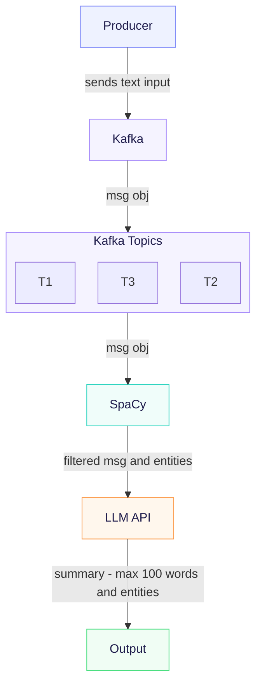

<!-- Conceptual pipeline diagram (renders on GitHub) -->

```mermaid
---
config:
  layout: elk
---
flowchart TB
  subgraph KafkaTopics["Kafka Topics"]
    T3["T3"]
    T2["T2"]
    T1["T1"]
  end

  Producer["Producer"] -- sends text input --> Kafka["Kafka"]
  Kafka -- msg obj --> KafkaTopics
  KafkaTopics -- msg obj --> SpaCy["SpaCy"]
  SpaCy -- filtered msg and entities --> LLM["LLM API"]
  LLM -- "summary - max 100 words and entities" --> Output["Output"]

  Producer:::producerNode
  Kafka:::kafkaNode
  KafkaTopics:::kafkaNode
  SpaCy:::processingNode
  LLM:::llmNode
  Output:::outputNode

  classDef producerNode stroke:#818cf8,fill:#eef2ff,color:#1e1b4b
  classDef kafkaNode stroke:#a78bfa,fill:#f5f3ff,color:#1e1b4b
  classDef processingNode stroke:#2dd4bf,fill:#f0fdfa,color:#1e1b4b
  classDef llmNode stroke:#fb923c,fill:#fff7ed,color:#1e1b4b
  classDef outputNode stroke:#4ade80,fill:#f0fdf4,color:#1e1b4b

```
