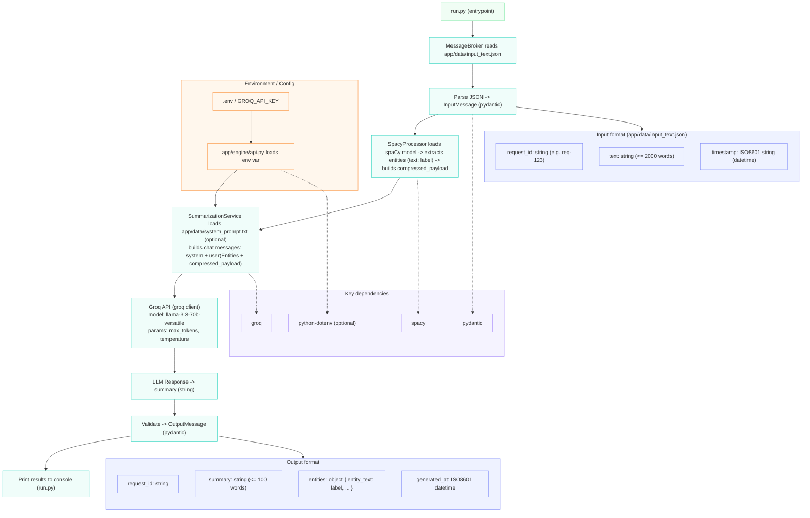

<!-- Pipeline diagram for GitHub rendering -->

```mermaid
flowchart TB
  %% Input schema
  subgraph InputSchema["Input format (app/data/input_text.json)"]
    direction TB
    I1["request_id: string (e.g. req-123)"]
    I2["text: string (<= 2000 words)"]
    I3["timestamp: ISO8601 string (datetime)"]
  end

  %% Environment / config
  subgraph Env["Environment / Config"]
    ENV[".env / GROQ_API_KEY"]
    API["app/engine/api.py loads env var"]
  end

  %% Output schema
  subgraph OutputSchema["Output format"]
    direction TB
    O1["request_id: string"]
    O2["summary: string (<= 100 words)"]
    O3["entities: object { entity_text: label, ... }"]
    O4["generated_at: ISO8601 datetime"]
  end

  %% Dependencies
  subgraph Deps["Key dependencies"]
    G["groq"]
    S["spacy"]
    P["pydantic"]
    D["python-dotenv (optional)"]
  end

  %% Main flow
  Run["run.py (entrypoint)"] --> Broker["MessageBroker reads app/data/input_text.json"]
  Broker --> InputParse["Parse JSON -> InputMessage (pydantic)"]
  InputParse --> InputSchema
  InputParse --> NLP["SpacyProcessor loads spaCy model -> extracts entities (text: label) -> builds compressed_payload"]
  NLP --> LLM["SummarizationService loads app/data/system_prompt.txt (optional)\nbuilds chat messages: system + user(Entities + compressed_payload)"]
  ENV --> API
  API --> LLM
  LLM --> Groq["Groq API (groq client)\nmodel: llama-3.3-70b-versatile\nparams: max_tokens, temperature"]
  Groq --> Summary["LLM Response -> summary (string)"]
  Summary --> OutputValidate["Validate -> OutputMessage (pydantic)"]
  OutputValidate --> OutputSchema
  OutputValidate --> Print["Print results to console (run.py)"]

  %% Dependency links
  LLM -.-> G
  NLP -.-> S
  InputParse -.-> P
  API -.-> D

  %% Styling groups (informational)
  classDef schema stroke:#818cf8,fill:#eef2ff,fontWeight:700;
  classDef service stroke:#2dd4bf,fill:#f0fdfa,fontWeight:700;
  classDef dep stroke:#a78bfa,fill:#f5f3ff,fontWeight:700;
  classDef config stroke:#fb923c,fill:#fff7ed,fontWeight:700;
  classDef main stroke:#4ade80,fill:#f0fdf4,fontWeight:700;

  class InputSchema,I1,I2,I3 schema;
  class OutputSchema,O1,O2,O3,O4 schema;
  class Deps,G,S,P,D dep;
  class Env,ENV,API config;
  class Run,Broker,InputParse,NLP,LLM,Groq,Summary,OutputValidate,Print service;
  class Run main;

```
